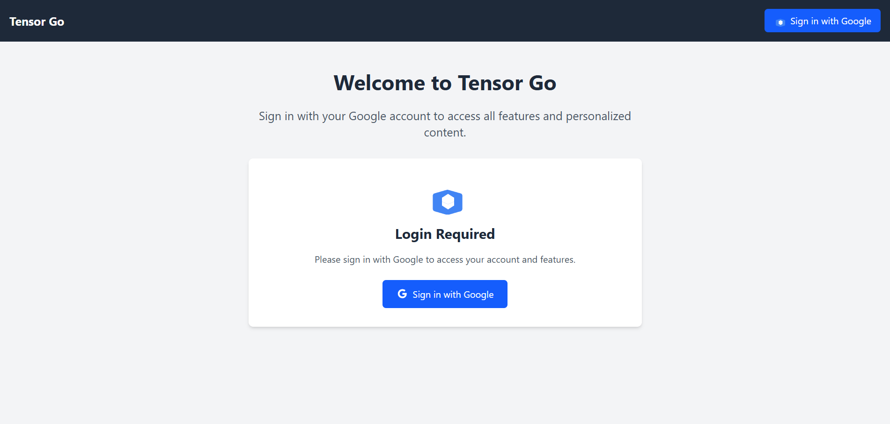
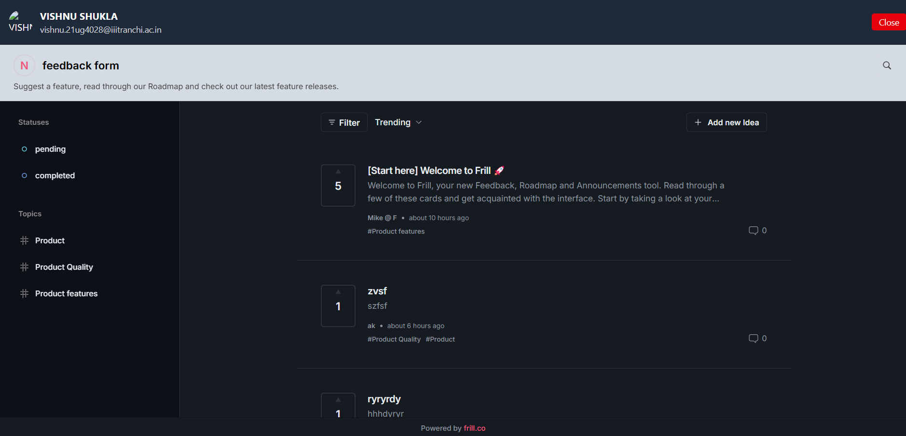
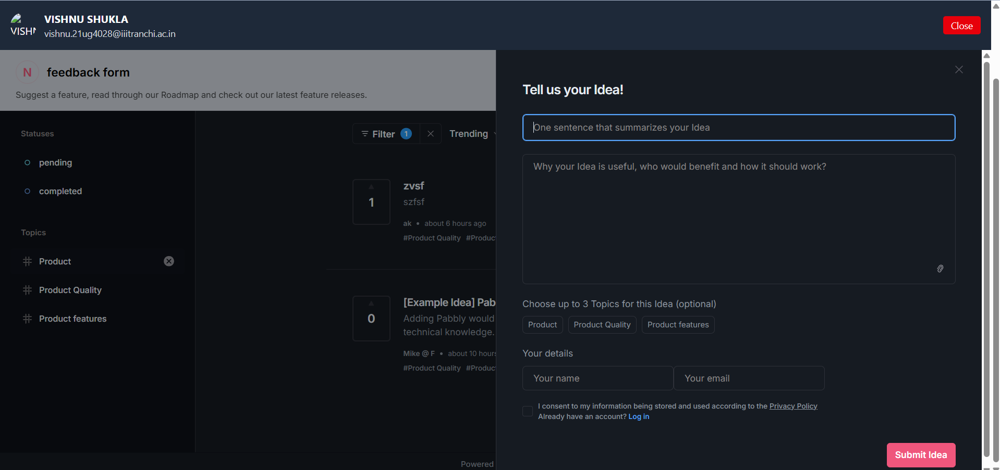
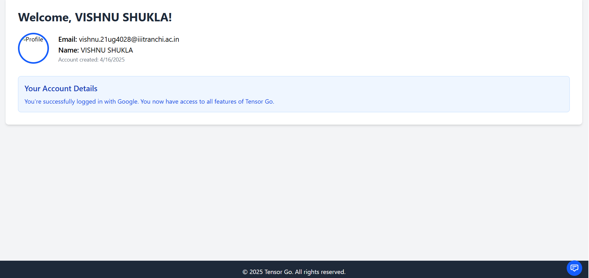

# Tensor Go

A full-stack web application with Google OAuth authentication, user profiles, and feedback integration using Frill.

## Application Screenshots






## Features

- **Google OAuth Authentication**: Secure login using Google accounts
- **User Profile Management**: View and manage user profile information
- **Dashboard Interface**: User-friendly dashboard for authenticated users
- **Feedback Widget**: Integrated Frill feedback system for user comments and suggestions
- **Responsive Design**: Built with Tailwind CSS for a fully responsive experience

## Tech Stack

### Frontend
- React 19
- React Router 7
- Tailwind CSS 4
- Vite 6
- Axios for API requests

### Backend
- Express.js
- MongoDB with Mongoose
- Passport.js for authentication
- Express Session for session management

## Getting Started

### Prerequisites
- Node.js (v18 or higher)
- MongoDB database (local or Atlas)
- Google OAuth credentials

### Installation

1. Clone the repository
```bash
git clone https://github.com/yourusername/tensor-go.git
cd tensor-go
```

2. Install dependencies for both frontend and backend
```bash
# Install root dependencies
npm install

# Install frontend dependencies
cd frontend
npm install
cd ..

# Install backend dependencies
cd backend
npm install
cd ..
```

3. Environment Setup

Create `.env` files in both the backend and frontend directories:

**Backend (.env)**
```
GOOGLE_CLIENT_ID=your_google_client_id
GOOGLE_CLIENT_SECRET=your_google_client_secret
PORT=8000
SESSION_SECRET=your_session_secret
MONGODB_URI=your_mongodb_connection_string
NODE_ENV=development
CLIENT_URL=http://localhost:5173
JWT_SECRET=your_jwt_secret
```

**Frontend (.env)**
```
VITE_API_URL=http://localhost:8000
```

4. Running the application

Development mode:
```bash
# Run backend and frontend concurrently
npm run server  # In one terminal
npm run client  # In another terminal
```

Production build:
```bash
npm run build
```

## Project Structure

```
.
├── package.json          # Root package.json with scripts
├── backend/              # Express server
│   ├── config/           # Configuration files
│   ├── models/           # MongoDB models
│   └── routes/           # API routes
└── frontend/             # React app
    ├── public/           # Static files
    └── src/              # React source files
        ├── components/   # Reusable components
        ├── context/      # React context providers
        └── pages/        # Page components
```

## Authentication Flow

1. User clicks "Sign in with Google"
2. User is redirected to Google for authentication
3. After successful authentication, Google redirects back to our application
4. A session is created and the user is redirected to the home page
5. Protected routes check for authentication status before rendering

## Deployment

This app can be deployed on various platforms:

- Heroku
- Vercel
- Netlify (frontend)
- AWS
- DigitalOcean

Follow the deployment guides for your preferred platform.

## Contributing

1. Fork the repository
2. Create a feature branch: `git checkout -b feature/amazing-feature`
3. Commit your changes: `git commit -m 'Add amazing feature'`
4. Push to the branch: `git push origin feature/amazing-feature`
5. Open a pull request

## License

This project is licensed under the MIT License - see the LICENSE file for details.

## Acknowledgments

- [React](https://reactjs.org/)
- [Express](https://expressjs.com/)
- [Tailwind CSS](https://tailwindcss.com/)
- [Frill](https://frill.co/) for feedback widget integration
- [Passport.js](http://www.passportjs.org/) for authentication